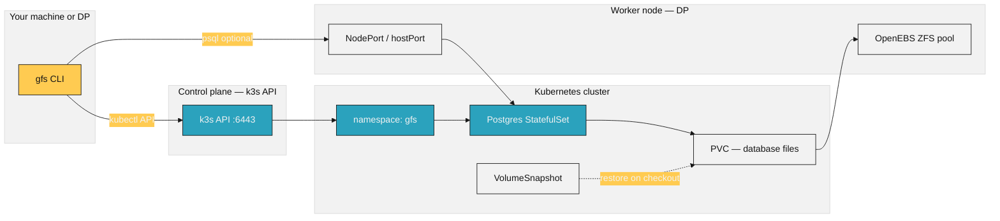
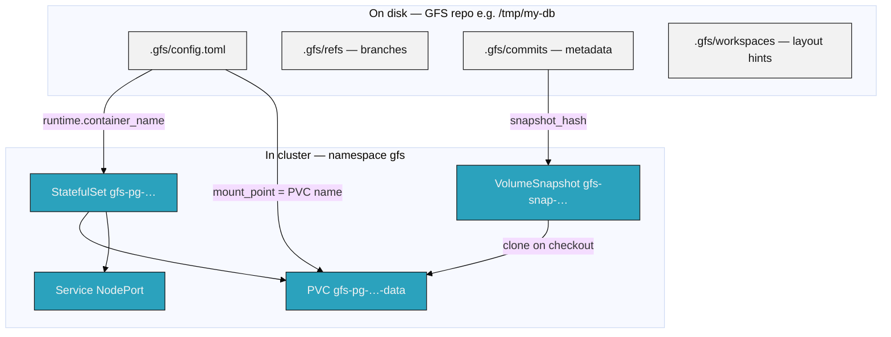
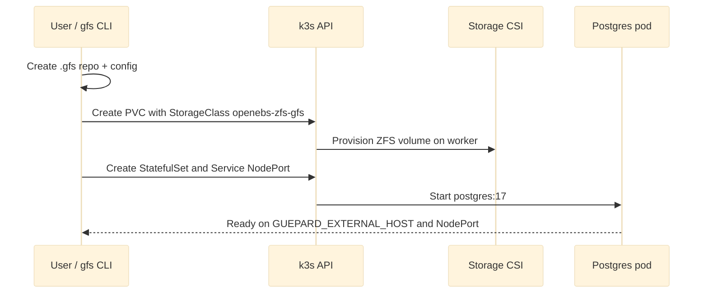
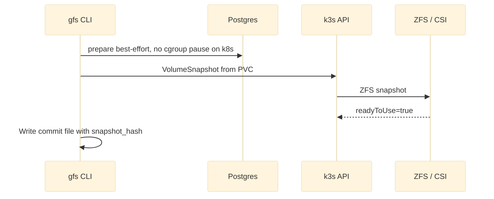
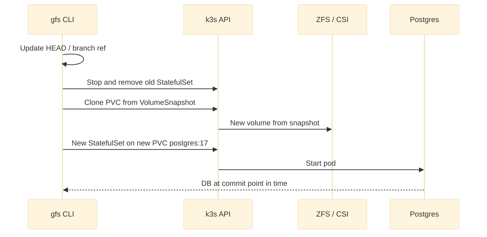
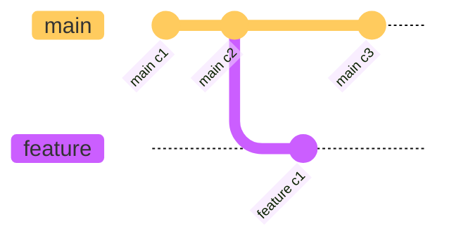
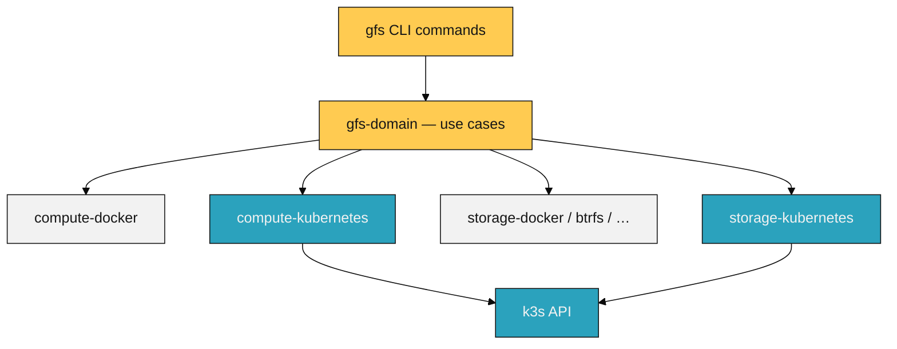
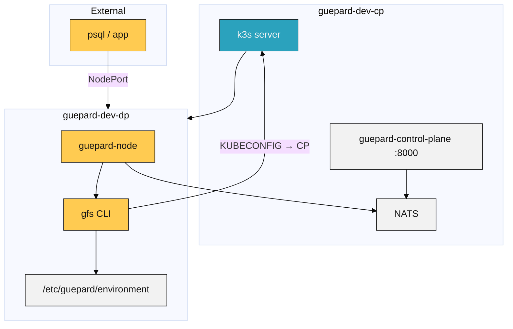

# GFS + k3s architecture

Git-like version control for databases, backed by Kubernetes storage and compute.

---

## The idea in one sentence

**GFS** tracks database history (commits, branches, checkout). On k3s, each “database workspace” is a **Postgres pod + disk (PVC)**; each **commit** is a **VolumeSnapshot** of that disk; **checkout** restores a new disk from that snapshot and starts a new pod.

---

## Laptop vs data plane

| Where you run `gfs` | k3s access |
|---------------------|------------|
| **Developer laptop** | **Console remote only** — `GFS_RUNTIME_PROVIDER=guepard` or `gfs init --remote`. No `KUBECONFIG` to CP. See [console-remote.md](./console-remote.md). |
| **DP host (SSM)** | `KUBECONFIG=/etc/guepard/kubeconfig` — ops/debug only (`kubectl get pods -n gfs`). |
| **guepard-node** | In-process GFS + k8s adapters; NATS from CP. |

---

## Who talks to whom (DP / legacy direct path)

| Piece | Role |
|-------|------|
| **gfs CLI** | On **DP** or legacy local k8s: talks to k3s API. On **laptop**: use console remote (no direct API). |
| **k3s API (CP)** | Control plane only. Schedules pods, creates PVCs and snapshots. DP kubeconfig points here (`10.0.1.101`), not `127.0.0.1`. |
| **Worker (DP)** | Runs Postgres pods and ZFS-backed volumes. External clients connect via **NodePort** on the worker public IP. |

---

## Glossary (technologies)

| Term | Meaning |
|------|---------|
| **GFS** | *Git For database Systems* — CLI that versions database state like Git versions code. |
| **k3s** | Lightweight Kubernetes distribution (single binary). Your **CP** runs the server; **DP** joins as a worker. |
| **Kubernetes (k8s)** | Orchestrator: deploys containers, networks, storage APIs. GFS uses it when `GFS_RUNTIME_PROVIDER=kubernetes`. |
| **kubectl / kubeconfig** | CLI + credentials to talk to the k3s API. On DP: `KUBECONFIG=/etc/guepard/kubeconfig`. |
| **Namespace `gfs`** | Isolated area in the cluster for all GFS Postgres workloads and PVCs. |
| **StatefulSet** | Kubernetes workload for **one** Postgres pod with a stable name and persistent disk. |
| **PVC** (*PersistentVolumeClaim*) | “Disk request” — Postgres data lives here (`/var/lib/postgresql/data`). |
| **StorageClass** | Template for how PVCs are provisioned. GFS uses **`openebs-zfs-gfs`** (ZFS on the node). |
| **CSI** | *Container Storage Interface* — plugin that creates real volumes on the node. OpenEBS ZFS is a CSI driver. |
| **VolumeSnapshot** | Point-in-time copy of a PVC. GFS creates one per **commit**. |
| **VolumeSnapshotClass** | How snapshots are taken — **`openebs-zfs-gfs-snapclass`**. |
| **NodePort** | Exposes Postgres port `5432` on a high port (30000–32767) on the worker so `psql` can reach it from outside. |
| **OpenEBS ZFS** | Storage engine using a ZFS pool (`zfspv-pool`) on each node — supports snapshots (unlike `local-path`). |
| **Commit** | GFS metadata + snapshot hash; database frozen-ish copy at that moment. |
| **Branch** | Named pointer to a commit (like Git). |
| **Checkout** | Move branch/HEAD to a commit and **restore** DB disk from that commit’s snapshot. |
| **guepard-node** | Optional DP daemon that runs GFS deploys via NATS; raw `gfs` CLI only needs env + kubectl. |

---

## Repo layout vs cluster layout

- **Local `.gfs/`** = Git-like history (commits, branches, messages). Small files only.
- **Cluster** = actual Postgres + data. Heavy lifting happens in k8s.

---

## Lifecycle: `gfs init`

1. CLI writes config: `runtime_provider = kubernetes`, `container_name = gfs-pg-<timestamp>`.
2. Kubernetes creates a **1Gi PVC** (configurable) on the worker ZFS pool.
3. Postgres starts; Service publishes **NodePort** for external access.

---

## Lifecycle: `gfs commit`

- Each commit stores a **snapshot hash** in `.gfs/commits/`.
- Cluster object: `VolumeSnapshot` named `gfs-snap-<hash-prefix>`.
- With `GFS_ALLOW_UNFROZEN_SNAPSHOT=1`, k8s skips Docker-style freeze — fine for dev; not crash-consistent for production unless you add quiesce logic.

---

## Lifecycle: `gfs checkout`

Checkout is the “time travel” step: new PVC from snapshot → new pod → same rows/schema as at that commit.

---

## Branching

- **`gfs branch feature`** — creates a ref only (no cluster change).
- **`gfs checkout feature`** — same as commit checkout: restore snapshot for that branch tip.
- **`gfs checkout -b new`** / **`gfs branch new -c`** — create ref + checkout (k8s restore path).

Branches do not share one running pod; each checkout can spawn a **new** StatefulSet + PVC clone.

---

## Adapters in the codebase

| Adapter | Implements |
|---------|------------|
| **compute-kubernetes** | StatefulSet, Service, exec, start/stop, connection info (NodePort + `GUEPARD_EXTERNAL_HOST`). |
| **storage-kubernetes** | PVC create, VolumeSnapshot create, PVC clone from snapshot. |

`compute_support` picks Docker vs Kubernetes from repo config / `GFS_RUNTIME_PROVIDER`.

---

## Environment variables (runtime)

| Variable | Purpose |
|----------|---------|
| `GFS_RUNTIME_PROVIDER=kubernetes` | Use k8s adapters. |
| `KUBECONFIG` | Path to kubeconfig (CP API, not DP localhost). |
| `GFS_K8S_STORAGE_CLASS` | PVC provisioner (`openebs-zfs-gfs`). |
| `GFS_K8S_SNAPSHOT_CLASS` | Snapshot class name. |
| `GFS_K8S_PVC_SIZE_GI` | PVC size (keep small on dev ZFS pools). |
| `GUEPARD_EXTERNAL_HOST` | Worker IP/hostname in `gfs status` connection string. |
| `GFS_K8S_EXPOSE_NODEPORT` | Expose Postgres via NodePort (default on). |
| `GFS_ALLOW_UNFROZEN_SNAPSHOT` | Allow commit without cgroup pause on k8s. |

---

## Production-style deployment (CP + DP)

- Run **`gfs`** on **DP** with CP kubeconfig.
- Connect clients to **DP public IP** + NodePort (or fixed `GFS_K8S_POSTGRES_NODE_PORT` if in range).
- **`guepard-node`** is optional for console-driven deploys; not required for manual CLI testing.

---

## What GFS does *not* do on k8s

- No in-cluster Git mirror of SQL — metadata stays in `.gfs/` on the host.
- No cgroup pause on k8s (unlike Docker); snapshots are best-effort unless extended.
- Does not manage OpenEBS install — you apply `deploy/kubernetes/openebs-zfs-gfs.yaml` and ZFS pools separately.

---

## Related docs

- [deploy/kubernetes/README.md](../deploy/kubernetes/README.md) — apply manifests, env vars.
- [k3s-ssm-smoketest.md](./k3s-ssm-smoketest.md) — cluster bootstrap via SSM.
- [k3s-e2e-proof.md](./k3s-e2e-proof.md) — full CLI matrix test results.
